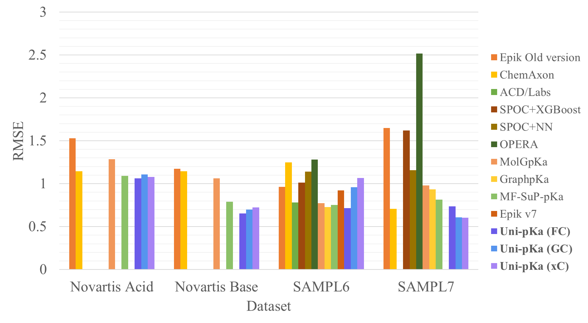
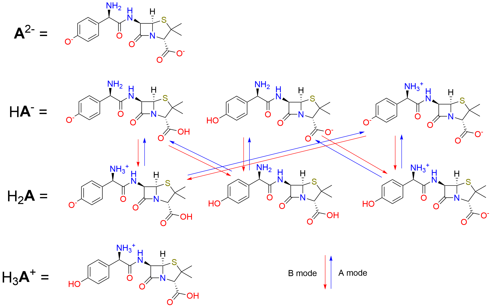
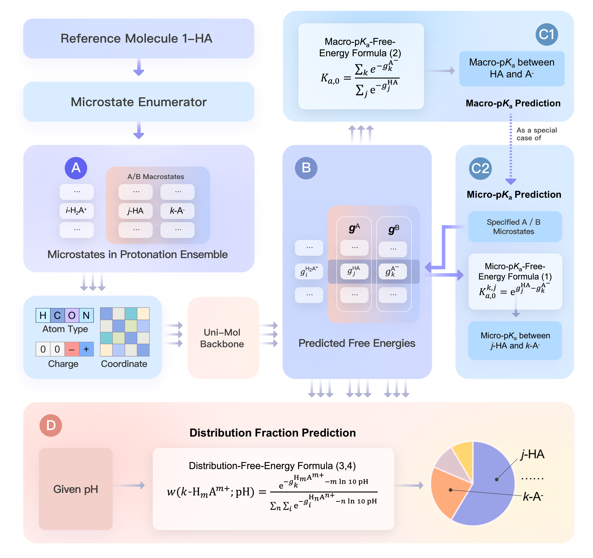

# Uni-p*K*<sub>a</sub>
The official implementation of the model Uni-p*K*<sub>a</sub> in the paper Bridging Machine Learning and Thermodynamics for Accurate p*K*<sub>a</sub> Prediction.

Published paper at [[JACS Au](https://pubs.acs.org/doi/10.1021/jacsau.4c00271)] Relevant preprint at [[ChemRxiv](https://chemrxiv.org/engage/chemrxiv/article-details/64e8da3879853bbd786ca4eb)] | Small molecule protonation state ranking demo at [[Bohrium App](https://bohrium.dp.tech/apps/uni-pka)] | Full datasets at [[AISSquare](https://www.aissquare.com/datasets/detail?pageType=datasets&name=Uni-pKa-Dataset)]

This machine-learning-based p*K*<sub>a</sub> prediction model achieves the state-of-the-art accuracy on several drug-like small molecule macro-p*K*<sub>a</sub> datasets.


Two core components of Uni-p*K*<sub>a</sub> framework are

- A microstate enumerator to systematically build the protonation
ensemble from a single structure.

- A molecular machine learning model to predict the free energy of each single structure. 

The model reaches the expected accuracy in the inference stage after the comprehensive data preparation by the enumerator, pretraining on the ChemBL dataset and finetuning on our Dwar-iBond dataset.


## Microstate Enumerator

### Introduction

It uses iterated template-matching algorithm to enumerate all the microstates in adjacent macrostates of a molecule's protonation ensemble from at least one microstate stored as SMILES.

The protonation template `smarts_pattern.tsv` modifies and augments the one in the paper [MolGpka: A Web Server for Small Molecule pKa Prediction Using a Graph-Convolutional Neural Network](https://pubs.acs.org/doi/10.1021/acs.jcim.1c00075) and its open source implementation (MIT license) in the Github repository [MolGpKa](https://github.com/Xundrug/MolGpKa/blob/master/src/utils/smarts_pattern.tsv).

### Usage

`main.py` is to reconstruct a plain p*K*<sub>a</sub> dataset to the Uni-p*K*<sub>a</sub> standard macro-p*K*<sub>a</sub> format with fully enumerated microstates.

```shell
cd enumerator
python main.py enum -i <input> -o <output> -m <mode>
```

The recommended environment is
```yaml
python = 3.8.13
rdkit = 2021.09.5
numpy = 1.20.3
pandas = 1.5.2
```

The `<input>` dataset is assumed be a csv-like file with a column storing SMILES. There are two cases allowed for each entry in the dataset.

1. It contains only one SMILES. The Enumerator helps to build the protonated/deprotonated macrostate and complete the original macrostate.
    - When `<mode>` is "A", it will be considered as an acid (thrown into A pool). 
    - When `<mode>` is "B", it will be considered as a base (thrown into B pool).
2. It contains a string like "A1,...,Am>>B1,...Bn", where A1,...,Am are comma-separated SMILES of microstates in the acid macrostate (all thrown into A pool), and B1,...,Bn are comma-separated SMILES of microstates in the base macrostate(all thrown into B pool). The Enumerator helps to complete the both.



The `<mode>` "A" (default) or "B" determines which pool (A/B) is the reference structures and the starting point of the enumeration.

The `<output>` dataset is then constructed after the enumeration.

## Machine Learning Model

### Introduction

It is a [Uni-Mol](https://github.com/dptech-corp/Uni-Mol)-based neural network. By embedding the neural network into thermodynamic relationship between the free energy and p*K*<sub>a</sub> throughout the training and inference stages, the framework preserves physical consistency and adapts to multiple tasks.



### Usage

The recommended environment is the docker image.

```
docker pull dptechnology/unimol:latest-pytorch1.11.0-cuda11.3
```

See details in [Uni-Mol](https://github.com/dptech-corp/Uni-Mol/tree/main/unimol#dependencies) repository.

After the full datasets had been downloaded, use `scripts/pretrain_pka_mlm_aml.sh` to pretrain the model, use `scripts/finetune_pka_aml.sh` to finetune the model, use `infer_test.sh` to test the trained model on a macro-p*K*<sub>a</sub> dataset, and use `infer_free_energy.sh` to infer the free energy of given structures for any p*K*<sub>a</sub>-related tasks.

## Todo
Ready-to-run training workflow
